<a href="https://aziral.com">
  <picture>
    <source media="(prefers-color-scheme: dark)" srcset="assets/dark/hero.svg">
    
  </picture>
</a>

  <a href="https://aziral.com"><picture><source media="(prefers-color-scheme: dark)" srcset="assets/dark/button-website.svg"></picture></a>
  <a href="https://www.linkedin.com/in/olzhas-azirali-934a162aa"><picture><source media="(prefers-color-scheme: dark)" srcset="assets/dark/button-linkedin.svg"></picture></a>
  <a href="mailto:aziralgroup@gmail.com"><picture><source media="(prefers-color-scheme: dark)" srcset="assets/dark/button-email.svg"></picture></a>
  <a href="https://www.instagram.com/aziralgroup"><picture><source media="(prefers-color-scheme: dark)" srcset="assets/dark/button-instagram.svg"></picture></a>

<picture>
  <source media="(prefers-color-scheme: dark)" srcset="assets/dark/section-about.svg">
  
</picture>

<picture>
  <source media="(prefers-color-scheme: dark)" srcset="assets/dark/about.svg">
  
</picture>

<picture>
  <source media="(prefers-color-scheme: dark)" srcset="assets/dark/section-stack.svg">
  
</picture>

<picture>
  <source media="(prefers-color-scheme: dark)" srcset="assets/dark/stack.svg">
  
</picture>

<picture>
  <source media="(prefers-color-scheme: dark)" srcset="assets/dark/section-projects.svg">
  
</picture>

  <a href="https://github.com/azirali/AziralPDF-app"><picture><source media="(prefers-color-scheme: dark)" srcset="assets/dark/project-aziralpdf.svg"></picture></a>
  <a href="https://aziral.com"><picture><source media="(prefers-color-scheme: dark)" srcset="assets/dark/project-crm.svg"></picture></a>

  <a href="https://github.com/AZIRALGROUP/aziral-books-backend"><picture><source media="(prefers-color-scheme: dark)" srcset="assets/dark/project-books.svg"></picture></a>
  <a href="https://github.com/azirali/EcoTaxi"><picture><source media="(prefers-color-scheme: dark)" srcset="assets/dark/project-ecotaxi.svg"></picture></a>

  <a href="https://github.com/azirali/aziral-video-gen"><picture><source media="(prefers-color-scheme: dark)" srcset="assets/dark/project-videogen.svg"></picture></a>
  <a href="https://github.com/azirali/Solidcore"><picture><source media="(prefers-color-scheme: dark)" srcset="assets/dark/project-solidcore.svg"></picture></a>

  ▶ Try it live: <a href="https://ecotaxi-mu.vercel.app">EcoTaxi</a> · <a href="https://azirali.github.io/Solidcore/">Solidcore</a>

<picture>
  <source media="(prefers-color-scheme: dark)" srcset="assets/dark/section-activity.svg">
  
</picture>

<picture>
  <source media="(prefers-color-scheme: dark)" srcset="profile-3d-contrib/profile-azirali-dark.svg">
  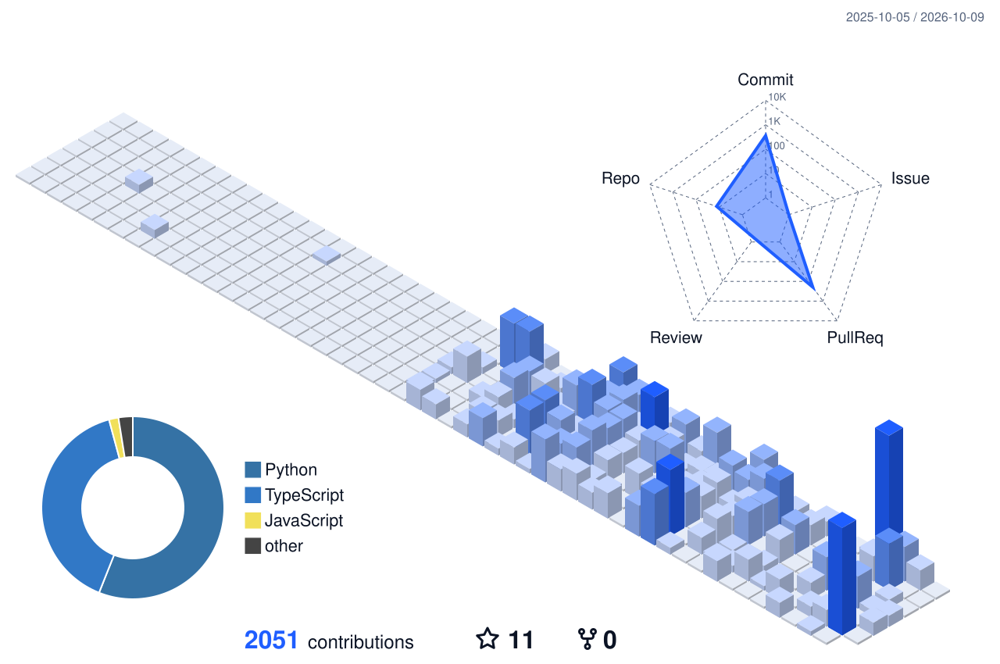
</picture>

  <picture>
    <source media="(prefers-color-scheme: dark)" srcset="https://streak-stats.demolab.com?user=azirali&hide_border=true&border_radius=24&background=0A0F1C&ring=2F7BFF&fire=22D3EE&currStreakNum=E8EEF9&sideNums=E8EEF9&currStreakLabel=60A5FA&sideLabels=8A9BB8&dates=4B5A75&stroke=1C2740">
    
  </picture>

<picture>
  <source media="(prefers-color-scheme: dark)" srcset="https://raw.githubusercontent.com/azirali/azirali/output/github-snake-dark.svg">
  
</picture>

<picture>
  <source media="(prefers-color-scheme: dark)" srcset="assets/dark/footer.svg">
  
</picture>

<!-- The images in assets/ are generated by scripts/build_assets.py -->
