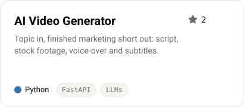
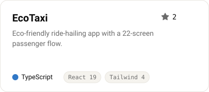
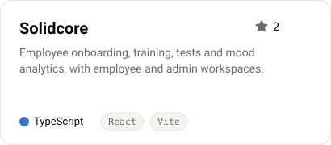
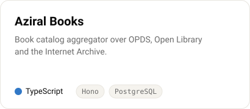
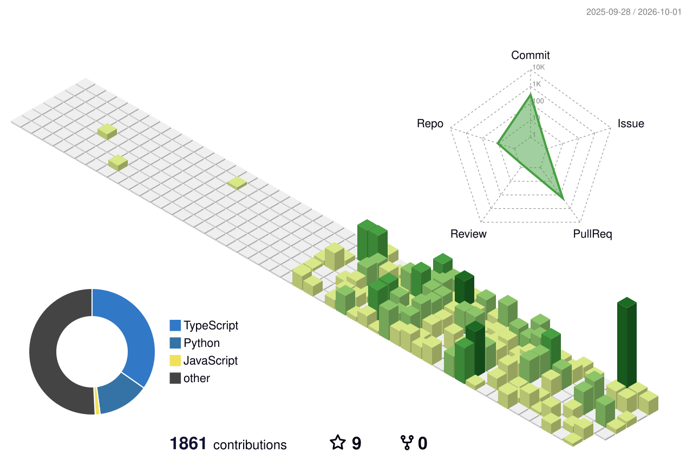

<a href="https://aziral.com">
  <picture>
    <source media="(prefers-color-scheme: dark)" srcset="assets/header-dark.svg">
    
  </picture>
</a>

<p align="center">
  <a href="https://aziral.com"></a>
  <a href="https://www.linkedin.com/in/olzhas-azirali-934a162aa"></a>
  <a href="mailto:aziralgroup@gmail.com"></a>
  <a href="https://t.me/aziralbot"></a>
  <a href="https://www.instagram.com/aziralgroup"></a>
</p>

I run **[AZIRAL](https://aziral.com)**, a product studio in Astana. We take web and mobile products from the first sketch to production: design, frontend, backend, infrastructure. I also maintain open-source tools for other developers, and I lean hard on AI-first workflows to ship fast without cutting corners.

## Open source

<a href="https://github.com/azirali/lucide-brands">
  <picture>
    <source media="(prefers-color-scheme: dark)" srcset="assets/cards/lucide-brands-dark.svg">
    
  </picture>
</a>

```sh
npm install lucide-brands && npx lucide-brands migrate   # your Github / Linkedin / Youtube icons are back
```

## Projects

<a href="https://github.com/azirali/aziral-video-gen"><picture><source media="(prefers-color-scheme: dark)" srcset="assets/cards/aziral-video-gen-dark.svg"></picture></a>
<a href="https://github.com/azirali/EcoTaxi"><picture><source media="(prefers-color-scheme: dark)" srcset="assets/cards/ecotaxi-dark.svg"></picture></a>
<a href="https://github.com/azirali/Solidcore"><picture><source media="(prefers-color-scheme: dark)" srcset="assets/cards/solidcore-dark.svg"></picture></a>
<a href="https://github.com/AZIRALGROUP/aziral-books-backend"><picture><source media="(prefers-color-scheme: dark)" srcset="assets/cards/aziral-books-dark.svg"></picture></a>

**Live demos:** [EcoTaxi](https://ecotaxi-mu.vercel.app) · [Solidcore](https://azirali.github.io/Solidcore/)

<details>
<summary><b>More work</b></summary>
<br>

| Project | What it is | Stack |
| --- | --- | --- |
| [**AZIRAL**](https://aziral.com) | The studio's website with an admin panel, lead API and a Telegram bot | React · Vite · Node.js · Express · SQLite |
| **AZIRAL CRM** (private) | Mobile-first business workspace: clients, projects, tasks, money, documents | Flutter · Dart · FastAPI · PostgreSQL · Redis |
| [**AziralPDF**](https://github.com/azirali/AziralPDF-app) (fork) | Self-hosted PDF platform with 50+ tools, a REST API and a desktop app | Java · Spring Boot · React · Docker |
| [**Play Bro**](https://github.com/azirali/play-bro-showcase) | Mobile rooms, friends and games together: the product showcase for Digital Bridge 2026 | Product · Python |

</details>

## Stack

<p align="center">
  
</p>

<p align="center">
  
  
  
  
  
</p>

## Activity

<picture>
  <source media="(prefers-color-scheme: dark)" srcset="assets/cards/stats-dark.svg">
  
</picture>

<picture>
  <source media="(prefers-color-scheme: dark)" srcset="profile-3d-contrib/profile-night-rainbow.svg">
  
</picture>

<picture>
  <source media="(prefers-color-scheme: dark)" srcset="https://raw.githubusercontent.com/azirali/azirali/output/github-snake-dark.svg">
  
</picture>

<sub>The header, project cards and stats are generated by <a href="scripts">scripts/</a> and refreshed nightly by GitHub Actions.</sub>
